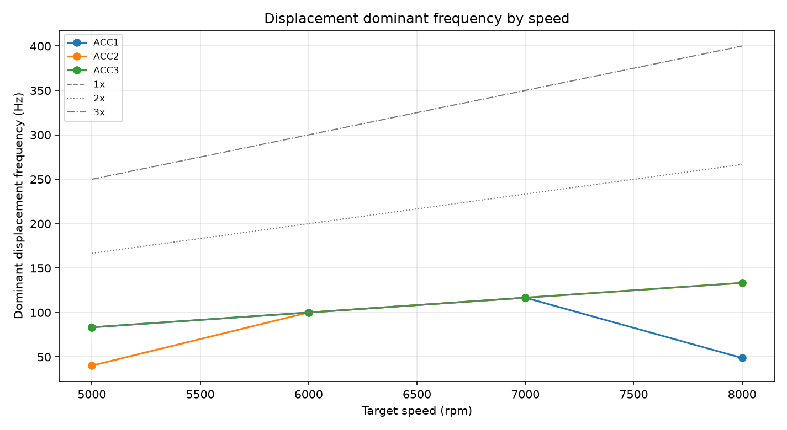
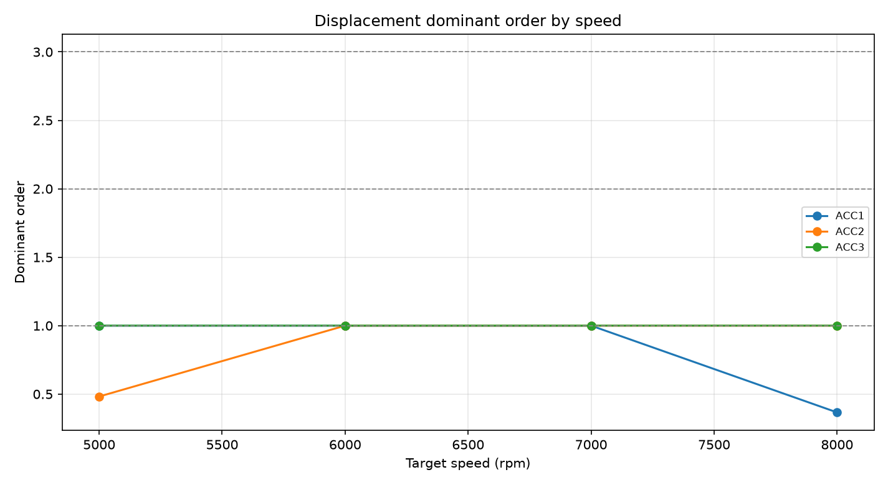
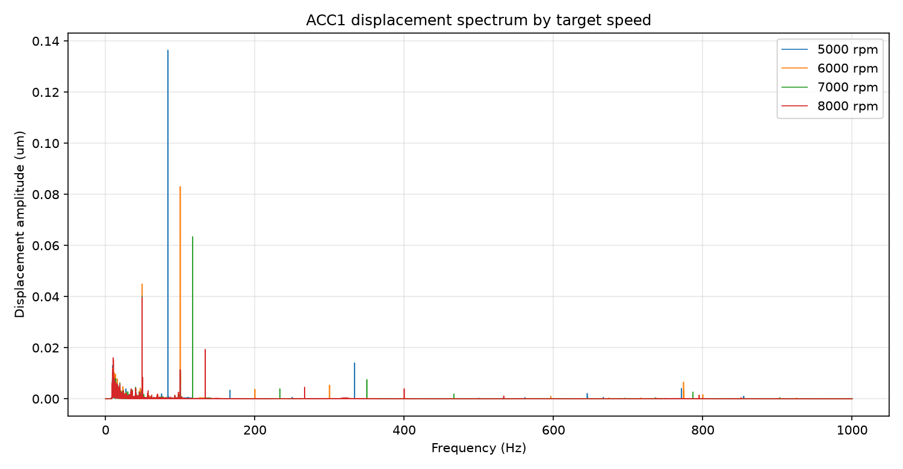
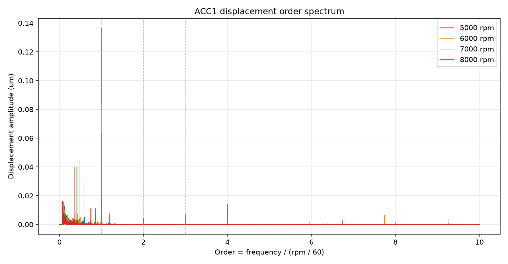
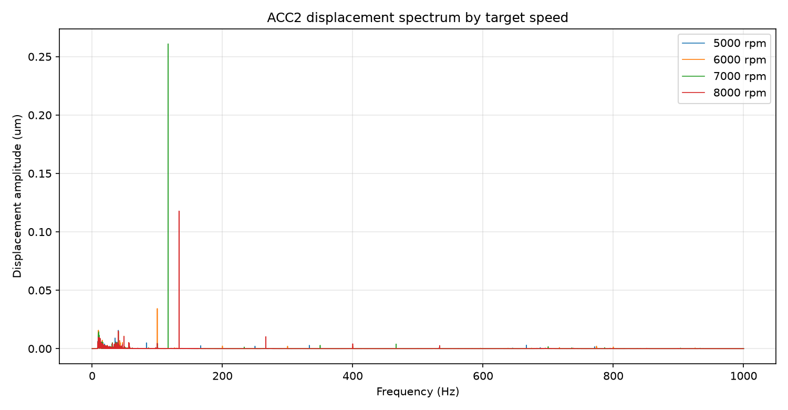
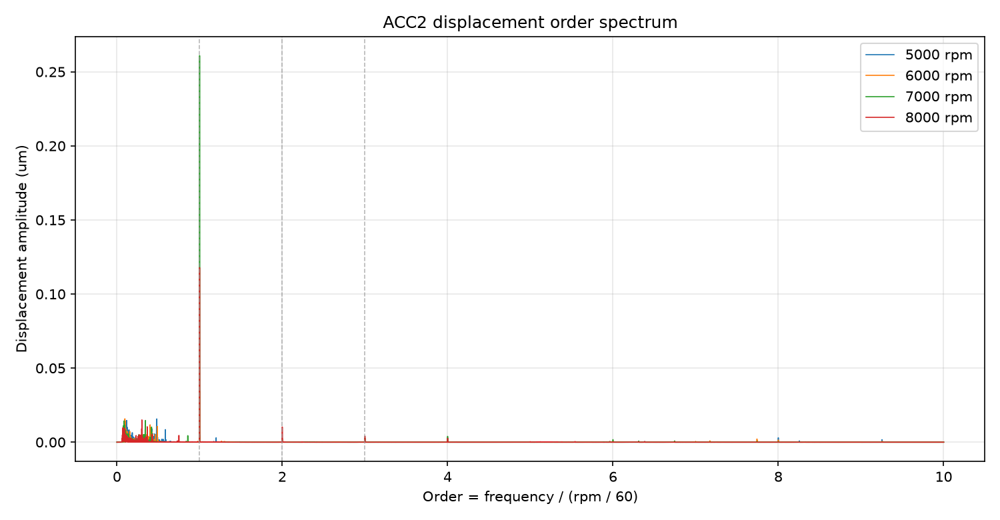
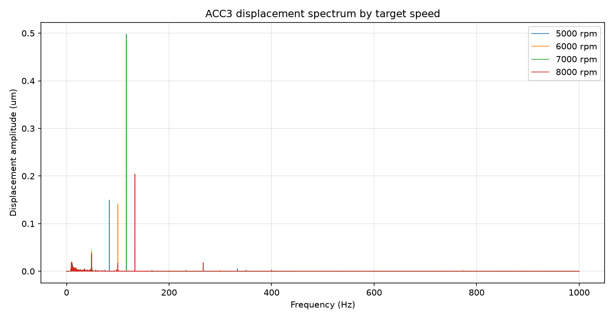
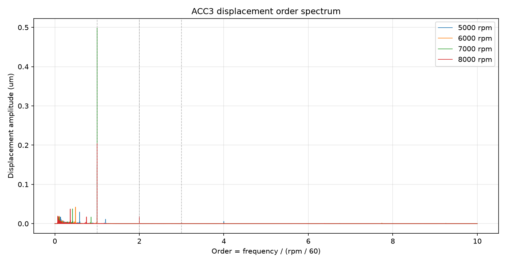

# 振动位移响应分析报告

本报告基于 `analysis_out/displacement_response/` 中新生成的结果手工整理。数据窗口沿用振动速度分析方法：每个目标转速达到稳定后的最后 60 秒。计算路径为：

```text
acceleration (g)
-> frequency-domain integration -> velocity (mm/s)
-> frequency-domain integration -> displacement (mm)
```

积分带宽仍使用 `10-1000 Hz`。报告中的位移幅值统一换算为 `um` 显示，便于阅读。

## 核心结论

1. 位移谱比速度谱更偏向低频。再积分一次相当于按 `1 / frequency` 继续压低高频，因此 1x 转频、低阶次和低频结构响应会更突出。
2. 12 个通道-转速组合中，10 个组合的位移主频落在 1x 转频。例外是 `ACC2 5000 rpm`，主频约 `40.18 Hz = 0.48x`；以及 `ACC1 8000 rpm`，主频约 `48.82 Hz = 0.37x`。
3. 台面 Y 向 `ACC3` 的位移 RMS 在四个转速下都高于两个前轴承通道，说明台面/结构响应对低频位移更敏感。
4. 7000 rpm 是本组数据中位移最强的转速。`ACC3` RMS 达 `0.3679 um`，`ACC2` RMS 达 `0.2035 um`，都明显高于 5000、6000、8000 rpm。
5. 不能把位移幅值理解为只由转速大小决定。位移主频大多跟随转频，但幅值在 7000 rpm 放大、8000 rpm 回落，说明结构传递、测点方向和安装耦合在位移响应中影响很大。

## 横轴换算为倍频

倍频谱使用标准阶次定义：

```text
order = frequency_hz / (rpm / 60)
```

也就是每个转速各自用自己的转频归一化横轴：

| 目标转速 | 转频 | 倍频横轴换算 |
| ---: | ---: | --- |
| 5000 rpm | 83.333 Hz | `order = frequency_hz / 83.333` |
| 6000 rpm | 100.000 Hz | `order = frequency_hz / 100.000` |
| 7000 rpm | 116.667 Hz | `order = frequency_hz / 116.667` |
| 8000 rpm | 133.333 Hz | `order = frequency_hz / 133.333` |

这样处理后，不同转速的 1x 转频都会对齐在横轴 `1.0`；2x、3x 分别对齐在 `2.0`、`3.0`。

## 主频分布





| 转速 | ACC1 主频 / 阶次 | ACC2 主频 / 阶次 | ACC3 主频 / 阶次 |
| ---: | ---: | ---: | ---: |
| 5000 rpm | 83.33 Hz / 1.00x | 40.18 Hz / 0.48x | 83.33 Hz / 1.00x |
| 6000 rpm | 100.00 Hz / 1.00x | 100.00 Hz / 1.00x | 100.00 Hz / 1.00x |
| 7000 rpm | 116.67 Hz / 1.00x | 116.67 Hz / 1.00x | 116.67 Hz / 1.00x |
| 8000 rpm | 48.82 Hz / 0.37x | 133.33 Hz / 1.00x | 133.33 Hz / 1.00x |

主频图的读法很直接：如果点贴着 1x 参考线，说明位移响应最强成分就是主轴转频同步响应。6000 和 7000 rpm 三个通道都贴近 1x；5000 rpm 的 ACC2 和 8000 rpm 的 ACC1 出现低于 1x 的主峰，说明这些通道在该转速下的低频/亚同步成分超过了转频成分。

## 位移 RMS 分布

| 转速 | ACC1 前轴承 Y | ACC2 前轴承 X | ACC3 台面 Y |
| ---: | ---: | ---: | ---: |
| 5000 rpm | 0.1173 um | 0.0562 um | 0.1309 um |
| 6000 rpm | 0.0902 um | 0.0595 um | 0.1270 um |
| 7000 rpm | 0.0966 um | 0.2035 um | 0.3679 um |
| 8000 rpm | 0.0739 um | 0.1039 um | 0.1711 um |

ACC3 在所有转速下都是最大位移响应通道。7000 rpm 的 ACC3 明显放大，是本批四转速结果中的最高值；同一转速下 ACC2 也明显升高，说明 7000 rpm 不只是台面单点异常，而是前轴承 X 向和台面 Y 向都出现了更强的低频位移响应。

## 频谱分布

### ACC1





ACC1 在 5000、6000、7000 rpm 时主峰分别落在 1x；8000 rpm 的最强峰落在约 0.37x，1x 仍存在但幅值只有 `0.0193 um`，低于 0.37x 主峰的 `0.0398 um`。这说明 ACC1 在 8000 rpm 的位移主导成分不再是转频本身。

### ACC2





ACC2 在 7000 rpm 的 1x 位移幅值最高，达到 `0.2609 um`。5000 rpm 是例外，主峰落在 `40.18 Hz / 0.48x`，而 1x 幅值只有 `0.0050 um`。这提示 ACC2 的低阶低频成分在 5000 rpm 下比转频更强。

### ACC3





ACC3 四个转速全部由 1x 主导，其中 7000 rpm 的 1x 位移幅值最高，为 `0.4980 um`。这与 RMS 表一致：台面 Y 向在 7000 rpm 下对转频同步激励的位移响应最强。

## 频带分布

位移能量主要集中在 `10-100 Hz` 和 `100-1000 Hz` 两个频段。5000 rpm 的 1x 是 `83.33 Hz`，自然落在 `10-100 Hz`；7000 和 8000 rpm 的 1x 分别是 `116.67 Hz` 和 `133.33 Hz`，自然落入 `100-1000 Hz`。

几个关键点：

- `ACC1 5000 rpm` 的 `10-100 Hz` 能量占比为 `93.3%`，主要来自 83.33 Hz 的 1x。
- `ACC3 7000 rpm` 的 `100-1000 Hz` 能量占比为 `95.5%`，主要来自 116.67 Hz 的 1x。
- `ACC2 7000 rpm` 的 `100-1000 Hz` 能量占比为 `90.5%`，对应其强 1x 位移响应。
- `ACC1 8000 rpm` 的 `10-100 Hz` 能量占比为 `79.4%`，与 48.82 Hz 的 0.37x 主峰一致。

## 解释边界

位移分析强化了低频和低阶次，因此它适合观察整体结构位移响应、转频同步位移和亚同步低频成分；但它不适合单独作为故障诊断结论。当前结果只能说明本批稳定窗口中哪些转速、通道和阶次的位移响应更强，不能直接命名为不平衡、松动、轴承故障或对中问题。

## 输出文件

- `displacement_response_channel_features.csv`：每个转速、每个通道的位移 RMS、主频、阶次、1x 幅值和频带占比。
- `displacement_response_order_peaks.csv`：主频和主阶次的精简表。
- `displacement_response_analysis.json`：机器可读结果。
- `figures/*displacement_spectrum*.png`：0-1000 Hz 频谱图。
- `figures/*displacement_order_spectrum*.png`：倍频谱图。
- `displacement_segments/*.npz.xz`：稳定窗口对应的位移片段。
