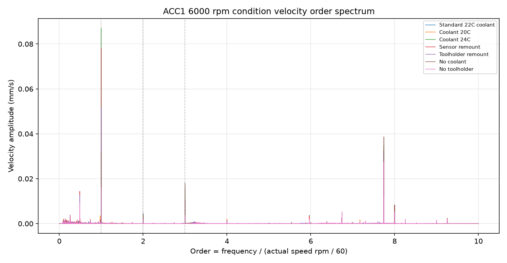
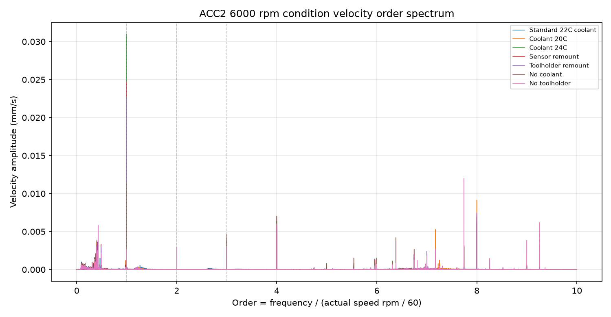
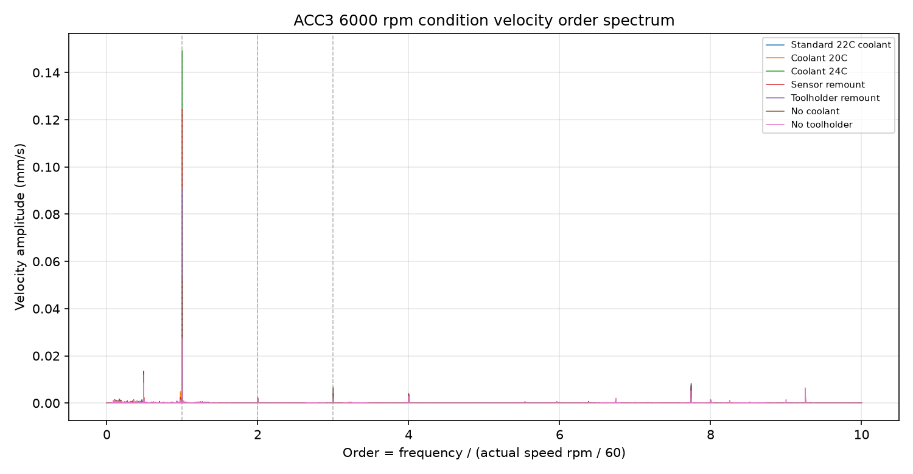

# 6000 rpm 多工况振动速度分析报告

本报告基于 `analysis_out/velocity_response/` 中已有结果，并补充计算了 6000 rpm 多工况的前轴承合成指标和倍频谱。分析窗口均为达到稳定转速后的最后 60 秒。

## 核心结论

1. 在标准、冷却 20℃、冷却 24℃、传感器重新放置、重新安装刀柄这五个工况中，三个通道的速度主频都稳定落在 `100 Hz = 1x`。这说明这些工况下振动速度主要由主轴同步转频成分主导。
2. 冷却 24℃显著放大 1x 速度响应。前轴承 X/Y 合成 1x 从标准工况的 `0.0565 mm/s` 升到 `0.0924 mm/s`，为标准的 `1.64x`；台面 ACC3 的 1x 从 `0.0886 mm/s` 升到 `0.1492 mm/s`，为标准的 `1.68x`。
3. 冷却 20℃整体低于标准工况。前轴承合成 1x 为标准的 `0.89x`，台面 ACC3 RMS 为标准的 `0.93x`。该结果支持“温控/冷却状态会改变 6000 rpm 同步响应幅值”。
4. 重新安装刀柄后几乎回到标准工况。前轴承合成 1x 为标准的 `1.00x`，前轴承 RMS 为 `0.98x`，台面 RMS 为 `0.98x`。在本批数据里，刀柄重装没有造成显著的振动速度变化。
5. 传感器重新放置会明显改变幅值。前轴承合成 1x 为标准的 `1.46x`，ACC1 1x 为标准的 `1.50x`，ACC3 1x 为标准的 `1.40x`。这说明传感器安装耦合对速度幅值影响很大，跨工况比较时必须固定安装状态。
6. 无冷却和不加刀柄时，前轴承 ACC1/ACC2 的主峰从 `1x` 转到约 `774 Hz`，即约 `7.74x`，但台面 ACC3 仍保持 `1x` 主导。同时前轴承合成 1x 分别降到标准的 `0.59x` 和 `0.29x`。这说明 1x 同步激励被削弱后，前轴承局部中频结构线变成最强速度峰。
7. 台面/前轴承 1x 传递比相当稳定。`ACC3_1x / front_1x_vector` 在所有工况中约为 `1.51-1.68`。因此，6000 rpm 多工况的主要变化更像是同步激励强弱变化，而不是台面传递路径发生了剧烈改变。

## 方法和数学指标

速度频谱记为 `V(f)`，主轴转频为：

```text
f_r = actual_speed_mean_rpm / 60
```

6000 rpm 下 `f_r` 约为 `100 Hz`。倍频阶次定义为：

```text
order = f / f_r
```

前轴承有两个正交测点：

- `ACC1`：前轴承外侧 Y 向
- `ACC2`：前轴承外侧 X 向

因此，前轴承同步响应不应只看单通道，而应看 X/Y 合成：

```text
front_1x_vector = sqrt(ACC1_1x^2 + ACC2_1x^2)
front_RMS_vector = sqrt(ACC1_RMS^2 + ACC2_RMS^2)
```

这个合成量比单看 ACC1 或 ACC2 更接近前轴承径向同步振动强度。

## 倍频和频谱图

### ACC1 前轴承 Y 向



ACC1 在标准、20℃、24℃、传感器重放、刀柄重装中都由 `1x` 主导。无冷却和不加刀柄时，最强峰转到约 `774 Hz`，也就是约 `7.74x`。这说明 Y 向前轴承测点在这两个工况下同步转频成分下降，中频结构响应成为主导。

### ACC2 前轴承 X 向



ACC2 的模式与 ACC1 类似：前五个工况由 `1x` 主导，无冷却和不加刀柄时主峰也转到约 `7.74x`。这条 774 Hz 线同时出现在 ACC1 和 ACC2，说明它不是单一方向的偶然尖峰，更可能是前轴承附近结构/支承系统的频率线。

### ACC3 台面 Y 向



ACC3 在所有工况中主峰都保持在 `1x`。这说明台面 Y 向主要接收主轴同步激励的整机响应；即使前轴承局部出现 774 Hz 主峰，台面通道仍以 1x 为主。

## 关键数值

| 工况 | 前轴承合成 RMS | 前轴承合成 1x | 相对标准 1x | 2x/1x | 3x/1x | ACC3/前轴承 1x | 主频特征 |
| --- | ---: | ---: | ---: | ---: | ---: | ---: | --- |
| 标准/默认22℃冷却 | 0.0548 | 0.0565 | 1.00x | 0.10 | 0.19 | 1.57 | 三通道 1x |
| 冷却20℃ | 0.0461 | 0.0501 | 0.89x | 0.07 | 0.16 | 1.68 | 三通道 1x |
| 冷却24℃ | 0.0760 | 0.0924 | 1.64x | 0.05 | 0.18 | 1.61 | 三通道 1x，幅值最高 |
| 振动传感器重新放置 | 0.0663 | 0.0822 | 1.46x | 0.05 | 0.14 | 1.51 | 三通道 1x，安装耦合增强 |
| 重新安装刀柄 | 0.0534 | 0.0565 | 1.00x | 0.06 | 0.21 | 1.60 | 接近标准 |
| 无冷却 | 0.0448 | 0.0335 | 0.59x | 0.15 | 0.56 | 1.59 | ACC1/2 转到 774 Hz，ACC3 仍 1x |
| 不加刀柄 | 0.0370 | 0.0165 | 0.29x | 0.21 | 0.29 | 1.65 | ACC1/2 转到 774 Hz，ACC3 仍 1x |

单位：速度为 `mm/s`。`2x/1x` 和 `3x/1x` 使用前轴承 X/Y 合成幅值计算。

## 分工况解释

### 标准/默认 22℃冷却

标准工况中 ACC1、ACC2、ACC3 都由 100 Hz 1x 主导。前轴承合成 1x 为 `0.0565 mm/s`，台面 1x 为 `0.0886 mm/s`。这可以作为本批 6000 rpm 工况的基准。

### 冷却 20℃

20℃下前轴承合成 1x 为 `0.0501 mm/s`，比标准低约 `11%`；ACC3 RMS 也低约 `7%`。主频仍为 1x，说明冷却 20℃没有改变主导频率，只降低了同步响应幅值。

物理解释上，这可能来自温度/冷却状态改变了轴承、主轴、刀柄和结构连接处的热状态与接触刚度，使同步响应幅值降低。但目前每个工况只有一次记录，不能把它严格归因于冷却温度本身。

### 冷却 24℃

24℃下前轴承合成 1x 升至 `0.0924 mm/s`，为标准的 `1.64x`；ACC3 1x 为标准的 `1.68x`。三通道均由 1x 主导，且台面/前轴承传递比保持在 `1.61`，接近其它工况。

这说明 24℃工况更像是“同步激励本身增强”，而不是某一个测点异常。可能原因包括热变形改变转子-支承系统的偏心状态、轴承预紧/间隙状态变化、冷却流量或温度场改变了结构边界条件。

### 振动传感器重新放置

传感器重放后，前轴承合成 1x 为标准的 `1.46x`，ACC3 1x 为标准的 `1.40x`。但该工况改变了测量边界，不能和其它工况完全等价比较。

稳定结论是：传感器安装耦合对速度幅值影响显著。后续若要用速度幅值判断主轴状态，必须固定传感器安装位置、安装力、线缆约束和接触方式，否则幅值变化可能来自测量系统而不是主轴本体。

### 重新安装刀柄

刀柄重装后，前轴承合成 1x 为 `0.0565 mm/s`，几乎等于标准；前轴承 RMS 是标准的 `0.98x`，ACC3 RMS 是标准的 `0.98x`。主频和倍频结构也保持 1x 主导。

这说明在本批数据里，重新安装刀柄没有引入可观测的 6000 rpm 速度响应变化。若关注刀柄装夹重复性，需要更多重复装夹样本，而不是只依赖这一组。

### 无冷却

无冷却时前轴承合成 1x 降到标准的 `0.59x`，但 ACC1/ACC2 的主峰转到 `774 Hz`。同时前轴承 `3x/1x` 升到 `0.56`，显著高于标准的 `0.19`。

这说明无冷却并不是简单“振动整体降低”。它削弱了 1x 同步成分，同时让更高阶/中频结构响应相对更突出。可能原因包括冷却液本身带来的附加载荷、热边界、阻尼和接触状态变化；无冷却后转频同步激励降低，但前轴承附近约 774 Hz 的结构线成为速度谱中最强成分。

### 不加刀柄

不加刀柄时前轴承合成 1x 只有标准的 `0.29x`，ACC3 1x 只有标准的 `0.31x`，是本批数据中同步响应最低的工况。ACC1/ACC2 主峰也转到约 `774 Hz`，而 ACC3 仍保持 1x。

这支持一个清晰结论：刀柄/负载状态是 6000 rpm 1x 同步响应的重要来源。去掉刀柄后，同步转频激励显著降低；但前轴承局部仍保留 774 Hz 中频线。

## 对物理机制的判断

从数据看，6000 rpm 振动速度可以拆成两类成分：

1. `1x = 100 Hz` 同步转频成分。它在大多数工况中主导速度谱，反映转子偏心、装夹质量分布、回转同步力、支承传递和结构放大的综合结果。
2. `774 Hz ≈ 7.74x` 中频结构线。它在无冷却和不加刀柄时成为 ACC1/ACC2 的最强峰，但没有成为 ACC3 的主峰，说明它更偏前轴承局部或前端结构响应。

前轴承合成 1x 和 ACC3 1x 的比例在各工况中相当稳定，约 `1.5-1.7`。这意味着台面通道主要是前端同步响应经过结构传递后的结果。冷却 24℃和传感器重放主要放大 1x；无冷却和不加刀柄主要削弱 1x，并暴露 774 Hz 线。

## 稳定、有数据支撑的结论

可以稳定支持的结论：

- 6000 rpm 下，标准、20℃、24℃、传感器重放、刀柄重装这五个工况均由 1x 主导。
- 冷却 24℃的同步速度响应最高，前轴承合成 1x 为标准的 `1.64x`。
- 刀柄重装与标准工况非常接近，单次测试中未见明显影响。
- 不加刀柄显著降低 1x，同步响应只剩标准的约 `0.29x`。
- 无冷却和不加刀柄会让前轴承 ACC1/ACC2 主峰转到约 `774 Hz`，但台面 ACC3 仍由 1x 主导。
- 传感器安装耦合会显著影响幅值，因此重放传感器工况不能直接当作主轴状态变化。

需要谨慎对待的结论：

- 冷却温度造成的差异目前只有单次样本，不能排除实验顺序、热历史或安装状态影响。
- 774 Hz 线的物理来源还不能确定。它可能是前端结构模态、支承局部响应、测点安装耦合或其它中频激励线，需要额外重复实验和敲击/模态验证。
- 主轴电流数据已知存在负值和尖峰，不应参与这些结论。

## 后续建议

若目标是长期监测 6000 rpm 状态，建议优先跟踪：

```text
front_1x_vector = sqrt(ACC1_1x^2 + ACC2_1x^2)
```

同时记录：

```text
ACC3_1x / front_1x_vector
ACC2_1x / ACC1_1x
774Hz_amp / 1x_amp
2x/1x, 3x/1x
```

其中 `front_1x_vector` 是最直接的前轴承同步响应指标；`ACC3/front` 判断结构传递是否变化；`ACC2/ACC1` 判断同步响应方向是否变化；`774Hz/1x` 判断中频结构线是否开始主导。
