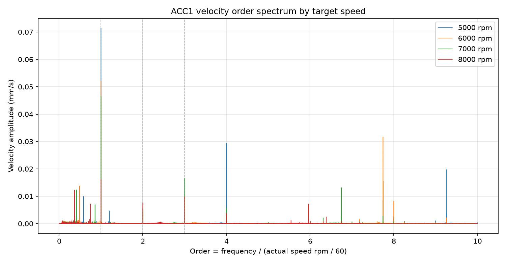
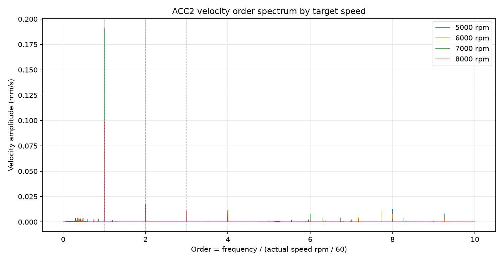
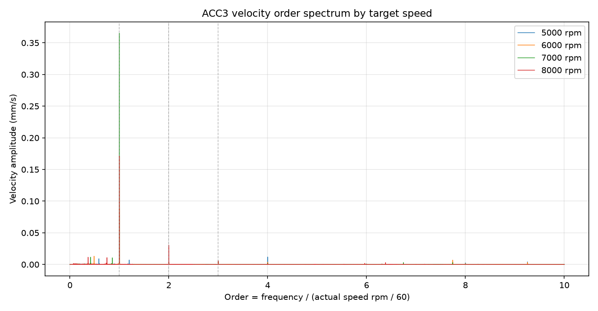

# 振动速度倍频频谱图

本结果基于 `analysis_out/velocity_response/velocity_segments/` 中已经生成的振动速度片段，不重新计算位移。每条曲线的横轴按各自实测平均转速归一化：

```text
order = frequency_hz / (actual_speed_mean_rpm / 60)
```

因此 1x、2x、3x 在图中分别对应横轴 `1`、`2`、`3`。

## 转速归一化参数

| 目标转速 | 实测平均转速 | 转频 | 横轴换算 |
| ---: | ---: | ---: | --- |
| 5000 rpm | 5000.005 rpm | 83.333410 Hz | `order = frequency_hz / 83.333410` |
| 6000 rpm | 6000.002 rpm | 100.000033 Hz | `order = frequency_hz / 100.000033` |
| 7000 rpm | 6999.997 rpm | 116.666618 Hz | `order = frequency_hz / 116.666618` |
| 8000 rpm | 7999.976 rpm | 133.332936 Hz | `order = frequency_hz / 133.332936` |

## 主峰阶次

| 转速 | ACC1 | ACC2 | ACC3 |
| ---: | ---: | ---: | ---: |
| 5000 rpm | 83.33 Hz / 1.00x | 666.67 Hz / 8.00x | 83.33 Hz / 1.00x |
| 6000 rpm | 100.00 Hz / 1.00x | 100.00 Hz / 1.00x | 100.00 Hz / 1.00x |
| 7000 rpm | 116.67 Hz / 1.00x | 116.67 Hz / 1.00x | 116.67 Hz / 1.00x |
| 8000 rpm | 133.33 Hz / 1.00x | 133.33 Hz / 1.00x | 133.33 Hz / 1.00x |

## 速度倍频频谱图







## 读图结论

- `ACC1` 在 5000、6000、7000、8000 rpm 的速度主峰都贴近 1x；随转速升高，1x 幅值从 5000 rpm 的 `0.0714 mm/s` 降到 8000 rpm 的 `0.0162 mm/s`。
- `ACC2` 在 6000、7000、8000 rpm 的速度主峰贴近 1x；5000 rpm 的速度主峰落在 666.67 Hz，也就是约 8.00x，说明该通道在 5000 rpm 下不是由 1x 主导。
- `ACC3` 四个转速的速度主峰都贴近 1x，台面 Y 向速度响应最稳定地跟随转频；7000 rpm 的 1x 幅值最高，为 `0.3651 mm/s`。
- 倍频图比普通频率图更适合横向比较不同转速：如果某个峰值随转速移动但属于同一阶次，它会在阶次横轴上对齐。

## 输出文件

- `velocity_order_spectrum_peaks.csv`：三通道、四转速的速度主峰频率、主峰阶次和 1x/2x/3x 幅值。
- `figures/ACC1_velocity_order_spectrum_by_speed.png`
- `figures/ACC2_velocity_order_spectrum_by_speed.png`
- `figures/ACC3_velocity_order_spectrum_by_speed.png`
