# 振动速度响应三维实验报告

本报告根据 `analysis_out/velocity_response/` 中已经生成的 CSV、JSON 和 PNG 结果手工整理，不由分析脚本模板生成。所有分析统一使用目标转速稳定后的最后 60 秒数据。

## 核心结论

1. 振动速度和原始加速度观察的是同一段机械运动的不同侧面。标准 6000 rpm 工况的 ACC1 中，加速度频谱能量约 96.7% 位于 1000 Hz 以上；积分成速度后，约 99.8% 能量集中在 10-1000 Hz。也就是说，速度把高频加速度细节压低，更突出低中频的整体机械响应。
2. 振动速度可以很好地反映主轴转速信息。主转速序列 5000/6000/7000/8000 rpm 中，12 个通道-转速组合里有 11 个速度主频贴近 1x 转频。只有 5000 rpm 的 ACC2 主频落在 666.7 Hz，而不是 83.3 Hz。
3. 不能简单说“速度幅值只由转速决定”。速度主频大多跟随转速，但幅值并不随转速单调上升。7000 rpm 的前轴承平均速度 RMS 最高，为 0.0903 mm/s；8000 rpm 反而降到 0.0472 mm/s。这说明转速激励存在，但结构响应、方向和测点位置也在放大或削弱响应。
4. 6000 rpm 多工况之间有可区分性。冷却 24℃、传感器重新放置会明显提高速度 RMS；重新安装刀柄与标准工况接近；无冷却和不加刀柄会降低 1x 转频速度幅值。不加刀柄时 ACC3 RMS 只有标准工况的 0.38 倍，ACC1 的 1x 幅值只有 0.31 倍。
5. 工况变化主要影响“低中频速度幅值、1x 同步转频成分、测点/方向耦合”。加速度 RMS 和速度 RMS 不总是同向变化，例如不加刀柄时速度下降，但 ACC1 加速度 RMS 反而约为标准的 1.13 倍，说明高频加速度背景和低中频速度响应不能混为一谈。

## 指标小词典

- RMS：均方根。可以当成这段信号的“平均振动强度”。RMS 越大，整体振动越强。
- 峰值：60 秒内最大瞬时幅值。它容易被偶发冲击影响。
- 峰峰值：最大值减最小值，表示波形上下摆动的总跨度。
- Crest factor：峰值除以 RMS。高 crest factor 说明尖峰多，低 crest factor 说明更平稳。
- 主频：指定频带里幅值最大的频率。它回答“最明显的周期性振动在哪里”。
- 1x：主轴每转一圈对应的频率，等于 `rpm / 60`。6000 rpm 的 1x 是 100 Hz。
- 2x/3x：1x 的 2 倍和 3 倍。它们常用于判断转速同步响应是否不只出现在基频。
- 频带能量占比：某个频率区间里的能量占总频谱能量的比例。它回答“能量集中在低频、中频还是高频”。
- 谱质心：频谱能量的重心。数值越高，整体越偏高频。
- Rolloff 85%：从低频往高频累加，到 85% 总能量时的频率。越高说明高频能量越多。
- ACC1/ACC2/ACC3：ACC1 是前轴承外侧 Y 向，ACC2 是前轴承外侧 X 向，ACC3 是台面 Y 向。

## 维度一：加速度与振动速度对比

### 图 1：加速度与速度时域波形

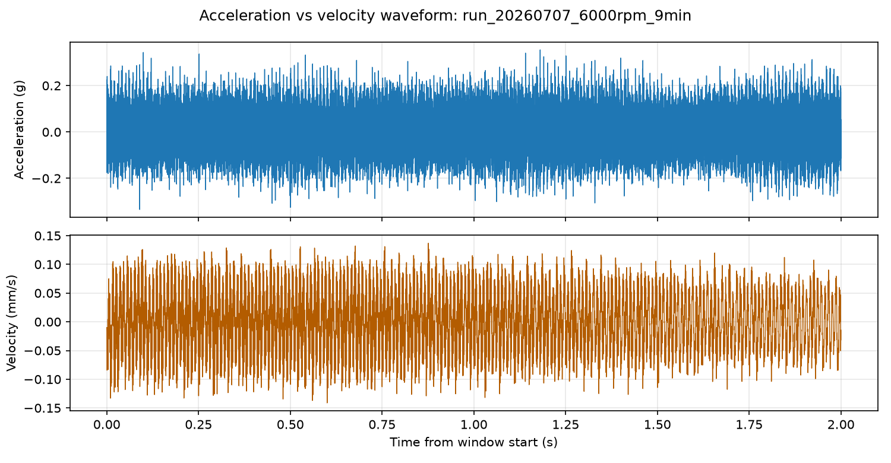

- 图中指标说明：上图是原始加速度，单位 g；下图是积分后的振动速度，单位 mm/s。横轴是同一稳定窗口开始后的时间。
- 怎么看这张图：加速度对高频细节更敏感，波形更碎；速度经过 10-1000 Hz 积分后，更强调能造成整体机械运动的低中频成分。
- 本图结论：速度不是把加速度简单放大，而是对频率重新加权后的结果。

### 图 2：0-1000 Hz 频谱对比

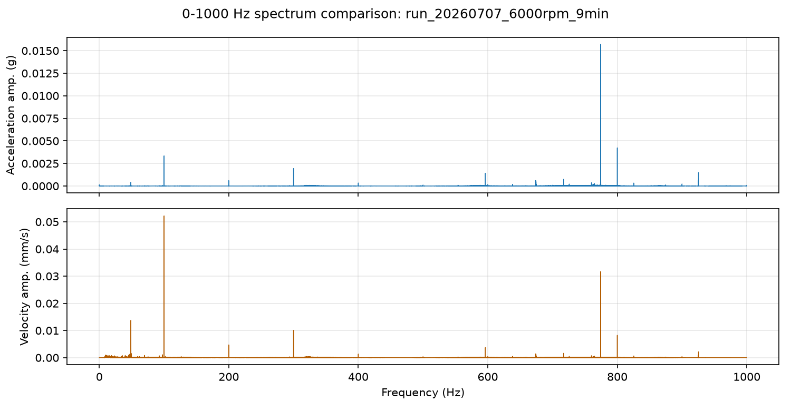

- 图中指标说明：横轴是频率，纵轴是频谱幅值。上图单位是 g，下图单位是 mm/s，两个纵轴不能直接相除。
- 怎么看这张图：看峰的位置，而不是只看峰高。标准 6000 rpm 下，速度主峰落在 100 Hz，也就是 1x 转频；加速度的 10-1000 Hz 主峰在约 774 Hz。
- 本图结论：速度更突出转速同步成分，加速度更容易被中高频响应主导。

### 图 3：完整频谱能量对比

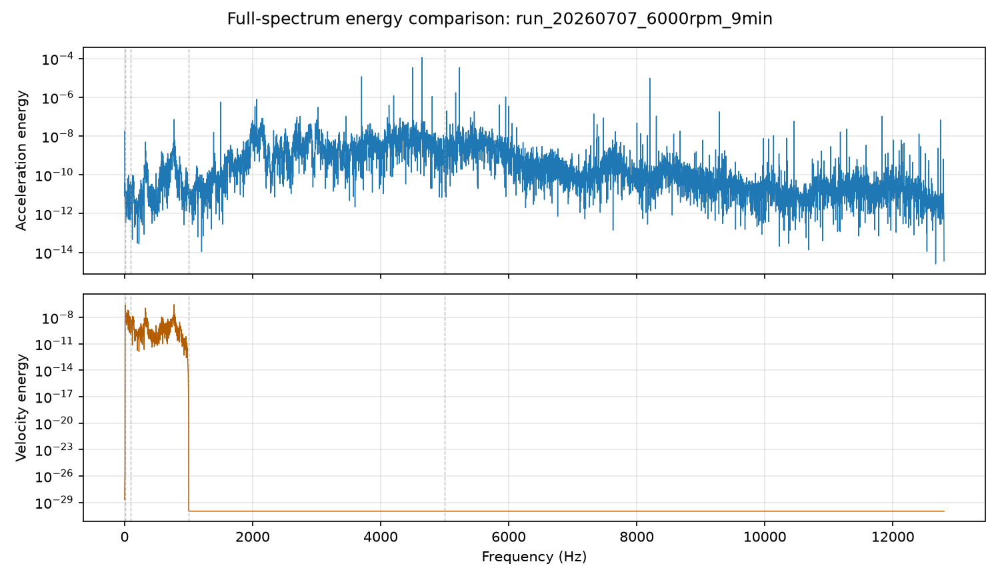

- 图中指标说明：这是 0 Hz 到 Nyquist 频率的完整频谱能量，纵轴使用对数刻度。虚线标出 10、100、1000、5000 Hz。
- 怎么看这张图：如果曲线在高频区域仍很高，说明信号能量偏高频；如果 10-1000 Hz 区域占主要部分，说明信号更偏低中频整体响应。
- 本图结论：加速度的能量重心在高频，速度的能量被积分迁移到 10-1000 Hz，所以二者给出的“振动强弱排序”可能不同。

### 图 4：分频带能量占比

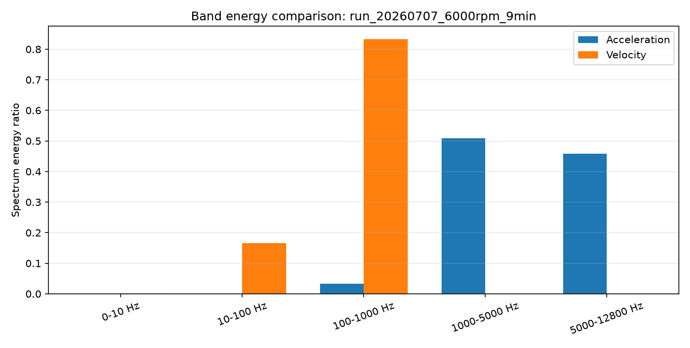

- 图中指标说明：每根柱子是该频带能量占总频谱能量的比例。比例越高，说明该频带贡献越大。
- 怎么看这张图：重点看加速度和速度的能量是否落在相同频带。
- 本图结论：标准 6000 rpm ACC1 中，加速度约 50.9% 能量在 1000-5000 Hz，45.8% 在 5000-12800 Hz；速度约 16.5% 在 10-100 Hz，83.3% 在 100-1000 Hz，高于 1000 Hz 基本被积分滤掉。

### 表 1：标准 6000 rpm ACC1 的加速度/速度关键指标

表中 RMS 表示平均强度；主频表示 10-1000 Hz 内最高峰位置；1x 幅值表示转频附近幅值；谱质心和 rolloff 越高，说明高频成分越多。

| 信号 | RMS | 峰值 | 主频 10-1000 Hz | 1x 幅值 | Crest factor | 谱质心 | Rolloff 85% | 1000 Hz 以上能量 |
| --- | ---: | ---: | ---: | ---: | ---: | ---: | ---: | ---: |
| 加速度 | 0.0818 g | 0.6115 g | 774.18 Hz | 0.00334 g | 7.48 | 4609 Hz | 6055 Hz | 96.7% |
| 振动速度 | 0.0501 mm/s | 0.1551 mm/s | 100.00 Hz | 0.05218 mm/s | 3.10 | 337 Hz | 774 Hz | 约 0% |

表 1 的读法：同一段数据里，加速度 RMS 主要被高频能量拉高；速度 RMS 则主要来自 100 Hz 及其附近的低中频响应。因此，速度更适合回答“主轴旋转相关的整体振动有多强”，加速度更适合保留“高频冲击或局部结构响应”。

## 维度二：不同转速下的振动速度特征

### 图 5：速度 RMS 随转速变化

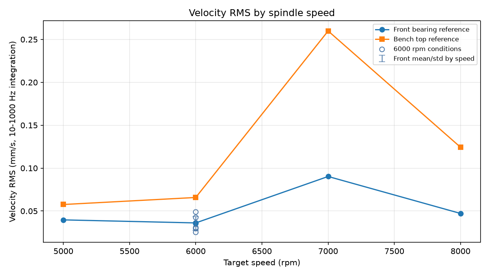

- 图中指标说明：RMS 是速度整体强度。前轴承曲线代表主轴附近响应，台面曲线代表结构/基座响应。
- 怎么看这张图：如果速度只是随转速增加而增加，曲线应近似单调上升；如果某个转速突然升高，说明该转速附近响应被放大。
- 本图结论：7000 rpm 的速度响应最强，8000 rpm 下降，说明速度幅值不是单纯由转速大小决定。

### 图 6：1x/2x/3x 速度幅值随转速变化

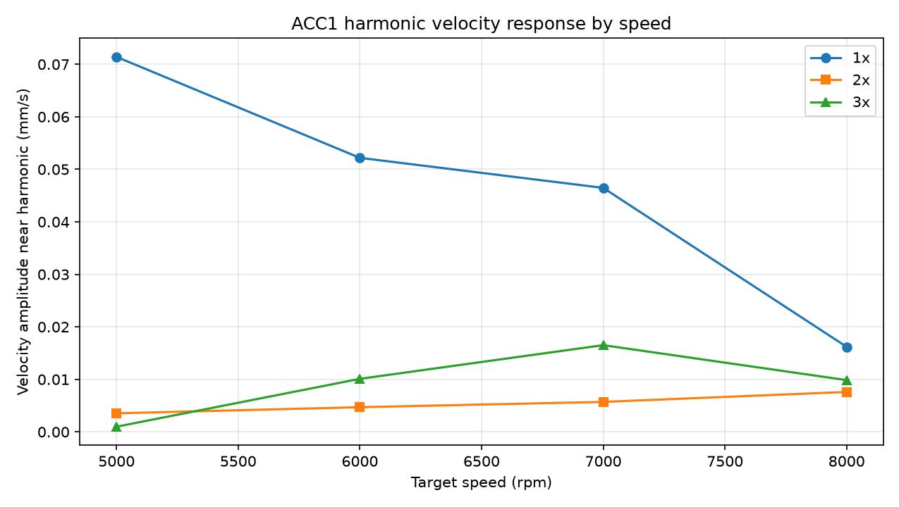

- 图中指标说明：1x 是转频，2x/3x 是倍频。幅值越大，说明该同步频率成分越强。
- 怎么看这张图：1x 若持续明显，说明速度信号能反映转速同步激励；2x/3x 较高时，说明响应不只在基频。
- 本图结论：ACC1 的 1x 在 5000、6000、7000 rpm 都是主要成分，8000 rpm 的 1x 变弱，2x/3x 相对更接近。

### 图 7：速度主频与转频关系

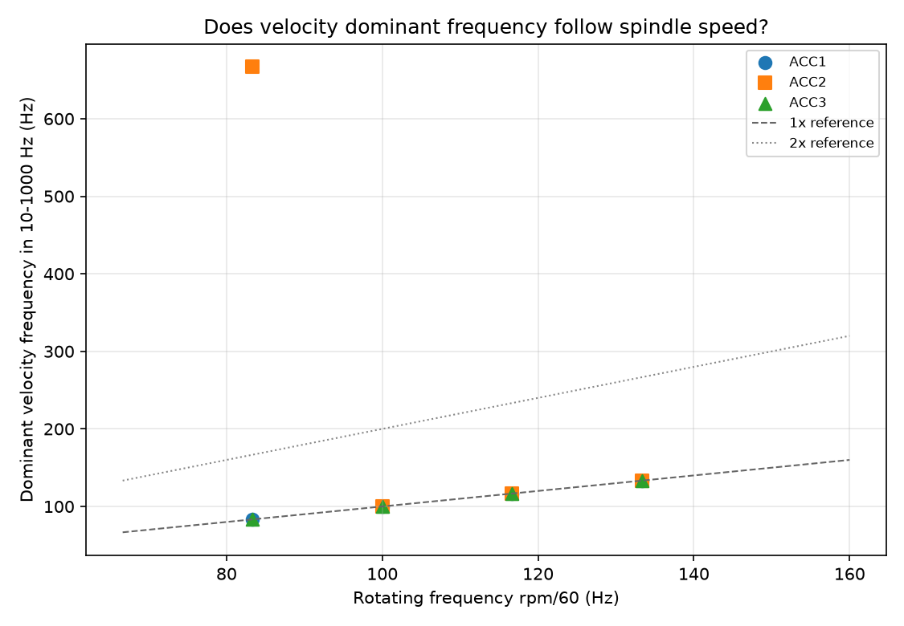

- 图中指标说明：横轴是转频 `rpm/60`，纵轴是速度在 10-1000 Hz 内的主频。虚线 y=x 表示主频等于 1x。
- 怎么看这张图：点越贴近 y=x，速度主频越能直接反映转速。
- 本图结论：主转速序列中 11/12 个点贴近 1x。速度能很好反映主轴转速信息，但 5000 rpm 的 ACC2 主频在 666.7 Hz，提醒我们仍需看通道和频带。

### 图 8：速度频带能量随转速变化

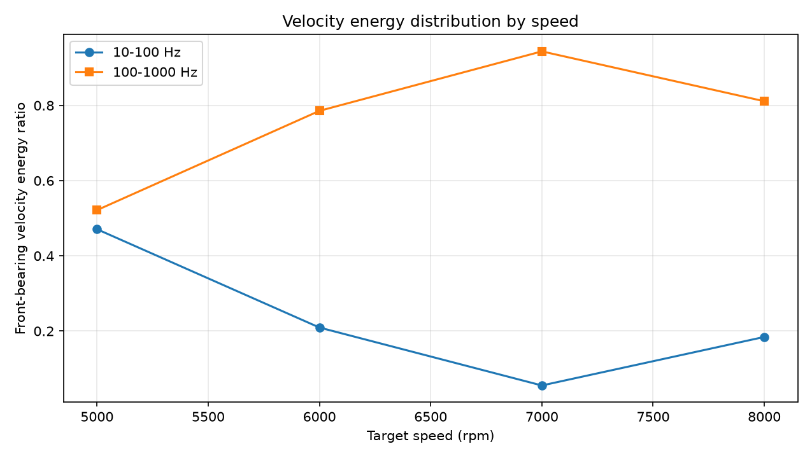

- 图中指标说明：显示前轴承速度能量在 10-100 Hz 与 100-1000 Hz 的占比。
- 怎么看这张图：5000 rpm 的 1x 是 83.3 Hz，落在 10-100 Hz；6000 rpm 的 1x 是 100 Hz，处在分界点；7000/8000 rpm 的 1x 落入 100-1000 Hz。
- 本图结论：转速升高后，速度能量自然更偏向 100-1000 Hz；这不是异常，本身就是转频位置移动的结果。

### 图 9：不同转速的 ACC1 速度频谱

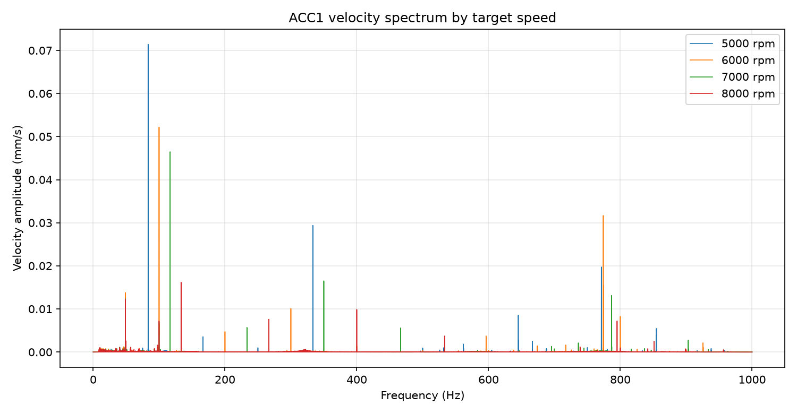

- 图中指标说明：叠加 5000、6000、7000、8000 rpm 的 ACC1 速度频谱。
- 怎么看这张图：看主峰是否从约 83.3 Hz 移到 100 Hz、116.7 Hz、133.3 Hz。
- 本图结论：ACC1 的速度主峰随转速移动，说明速度信号确实携带清楚的转速信息；但不同转速峰高不同，说明结构响应也参与。

### 表 2：主转速序列 ACC1 速度指标

表中 `转频` 是 `rpm/60`；`速度主频` 是速度谱最大峰；`1x-3x 能量占比` 越高，说明同步转速相关成分越集中。

| 转速 | 转频 | ACC1 RMS | 速度主频 | 1x 幅值 | 1x-3x 能量占比 | 10-100 Hz 占比 | 100-1000 Hz 占比 |
| ---: | ---: | ---: | ---: | ---: | ---: | ---: | ---: |
| 5000 rpm | 83.33 Hz | 0.0605 mm/s | 83.33 Hz | 0.0714 | 70.3% | 74.0% | 25.9% |
| 6000 rpm | 100.00 Hz | 0.0501 mm/s | 100.00 Hz | 0.0522 | 58.2% | 16.5% | 83.3% |
| 7000 rpm | 116.67 Hz | 0.0433 mm/s | 116.67 Hz | 0.0465 | 78.4% | 10.7% | 89.1% |
| 8000 rpm | 133.33 Hz | 0.0218 mm/s | 133.33 Hz | 0.0162 | 46.0% | 35.7% | 63.4% |

表 2 的读法：ACC1 主频严格跟随转频，说明“频率位置”能很好反映转速。但 RMS 和 1x 幅值不是单调的，说明“振动强度”还受到结构、方向和安装耦合影响。

## 维度三：6000 rpm 多工况区分

### 图 10：6000 rpm 各工况相对标准工况的 RMS 变化

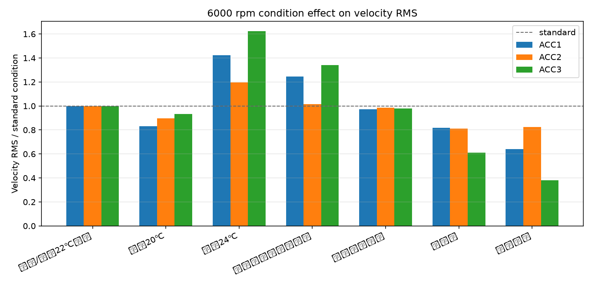

- 图中指标说明：纵轴是速度 RMS 相对标准/默认 22℃冷却工况的倍数。1.0 表示等于标准工况。
- 怎么看这张图：三路传感器都升高，说明整体响应增强；只有某一路明显变化，说明位置/方向/安装耦合更敏感。
- 本图结论：冷却 24℃整体偏高，传感器重新放置也明显偏高；重新安装刀柄几乎回到标准；无冷却和不加刀柄整体偏低。

### 图 11：6000 rpm 工况特征热图

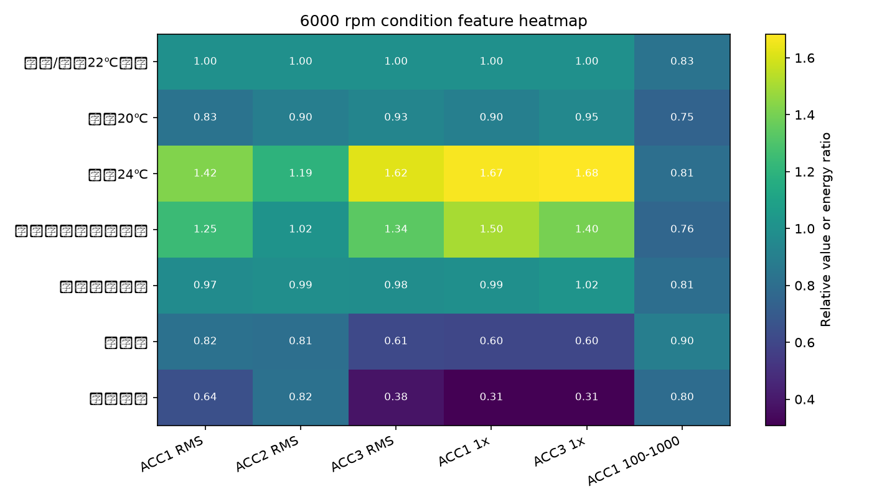

- 图中指标说明：RMS 和 1x 是相对标准工况的倍数，ACC1 100-1000 表示该频带能量占比。
- 怎么看这张图：横向看一个工况影响哪些特征，纵向看同一个特征在哪些工况最敏感。
- 本图结论：冷却 24℃主要放大 1x 和 RMS；不加刀柄主要削弱 1x 和台面速度；无冷却使 ACC1/ACC2 的主峰转到 774 Hz，说明 1x 被削弱后，中频结构线更显眼。

### 表 3：6000 rpm 多工况速度 RMS

表中数值单位为 mm/s。括号中的倍数是相对标准/默认 22℃冷却工况。倍数大于 1 表示该工况速度更强，小于 1 表示更弱。

| 工况 | ACC1 前轴承Y | ACC2 前轴承X | ACC3 台面Y | 主要变化 |
| --- | ---: | ---: | ---: | --- |
| 标准/默认22℃冷却 | 0.0501 (1.00x) | 0.0222 (1.00x) | 0.0658 (1.00x) | 基准 |
| 冷却20℃ | 0.0416 (0.83x) | 0.0199 (0.90x) | 0.0615 (0.93x) | 整体略低于标准 |
| 冷却24℃ | 0.0712 (1.42x) | 0.0265 (1.19x) | 0.1068 (1.62x) | 三通道均升高，台面最明显 |
| 振动传感器重新放置 | 0.0623 (1.25x) | 0.0226 (1.02x) | 0.0881 (1.34x) | Y 向和台面升高，说明放置/耦合影响大 |
| 重新安装刀柄 | 0.0487 (0.97x) | 0.0219 (0.99x) | 0.0645 (0.98x) | 接近标准，刀柄重装没有造成明显速度差异 |
| 无冷却 | 0.0410 (0.82x) | 0.0180 (0.81x) | 0.0402 (0.61x) | 1x 变弱，ACC1/ACC2 主峰转到约 774 Hz |
| 不加刀柄 | 0.0321 (0.64x) | 0.0183 (0.82x) | 0.0250 (0.38x) | 速度和 1x 显著下降，台面变化最大 |

### 表 4：6000 rpm ACC1 的工况细节

表中 `1x 相对倍数` 说明转频同步成分变强还是变弱；`100-1000 Hz 占比` 越高，说明能量越集中在中频；`速度主频` 如果不是 100 Hz，说明 1x 不再是最强峰。

| 工况 | RMS 相对倍数 | 1x 相对倍数 | 100-1000 Hz 占比 | 速度主频 | 谱质心 | 加速度 RMS 相对倍数 |
| --- | ---: | ---: | ---: | ---: | ---: | ---: |
| 标准/默认22℃冷却 | 1.00 | 1.00 | 83.3% | 100 Hz | 337 Hz | 1.00 |
| 冷却20℃ | 0.83 | 0.90 | 74.7% | 100 Hz | 236 Hz | 0.95 |
| 冷却24℃ | 1.42 | 1.67 | 81.2% | 100 Hz | 227 Hz | 0.98 |
| 振动传感器重新放置 | 1.25 | 1.50 | 76.1% | 100 Hz | 198 Hz | 0.92 |
| 重新安装刀柄 | 0.97 | 0.99 | 80.7% | 100 Hz | 303 Hz | 1.08 |
| 无冷却 | 0.82 | 0.60 | 89.8% | 774 Hz | 488 Hz | 1.12 |
| 不加刀柄 | 0.64 | 0.31 | 79.7% | 774 Hz | 516 Hz | 1.13 |

表 4 的读法：冷却 24℃和传感器重新放置都把 1x 放大，所以主要影响同步转速响应；无冷却和不加刀柄把 1x 削弱，导致 774 Hz 变成最强峰。注意无冷却/不加刀柄的加速度 RMS 反而升高，这说明高频加速度背景增强，但低中频速度响应减弱。

## 对“振动速度主要是转速激励的吗”的判断

可以谨慎地说：在本批数据里，振动速度的主频信息主要受转速激励控制，因为主频基本贴着 1x 转频移动。

但不能说速度幅值只由转速决定。幅值受至少三个因素影响：

1. 转速同步激励：1x 是否强，决定速度谱是否由转频主导。
2. 结构/安装耦合：7000 rpm 的 ACC2 和 ACC3 明显放大，说明测点方向和结构传递会改变幅值。
3. 工况状态：冷却 24℃、传感器重新放置、不加刀柄都会改变 RMS 和 1x，但改变方向不同。

因此，更准确的表述是：振动速度很好地反映了主轴转速频率；速度幅值则是转速激励、结构响应、安装/工况耦合共同作用的结果。

## 输出文件

- `velocity_response_run_summary.csv`：每个 run 的稳定窗口、实际转速和 run 级汇总。
- `velocity_response_channel_features.csv`：每个 run、每个通道的加速度和速度特征。
- `velocity_response_by_speed.csv`：按目标转速聚合的结果。
- `velocity_response_by_condition_6000.csv`：6000 rpm 多工况逐通道结果。
- `velocity_response_spectrum_energy.csv`：每个 run、通道、信号类型、频带的能量和占比。
- `velocity_response_analysis.json`：机器可读分析结果。
- `figures/*.png`：本报告引用的图。
- `velocity_segments/*.npz.xz`：稳定窗口对应的速度片段。

## 注意事项

本报告不做具体故障诊断。若要判断不平衡、松动、轴承问题或对中问题，还需要相位、重复实验、传感器安装一致性和更多工况验证。
